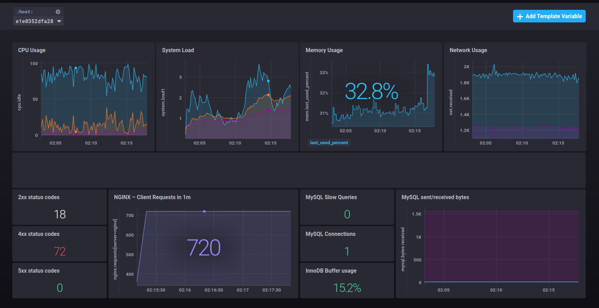

# TICK

Homework on TICK stack for monitoring course
## Stack

- **WordPress**: PHP-FPM 8.2 with WordPress
- **Database**: MySQL 8.0
- **Web Server**: Nginx (latest)
- **Monitoring**:
  - Telegraf 1.28 (metric collection)
  - Chronograf 1.10 (metric visualisation)
  - Kapacitor 1.6 (alerting)
  - InfluxDB 2.7 (metrics storage)

## Alerts

**Server Resources Alerts**

Alert rules for server resources are displayed in the following table:

| Severity | CPU Usage | Memory Usage | Disk Usage | Disk I/O | Network |
|---|---|---|---|---|---|
| **Info** |  >70% for 5min or more | >80% for 5min or more | >80% | Read/Write latency > 15ms | -
| **Warning** | >80% for 2min or more | >90% for 2min or more | >90% | Read/Write latency > 20ms | -
| **Critical** | >90% for 1min or more | >95% for 1min or more | >95% | Read/Write latency > 50ms | packet_loss=100%

An example of an alert sent by Kapacitor to a telegram chat is displayed below.

## Dashboard

Summary dashboard that shows server resources usage, MySQL server health and Nginx requests/responses info is displayed below:

Dashboard configuration is [here](dashboard.json).
